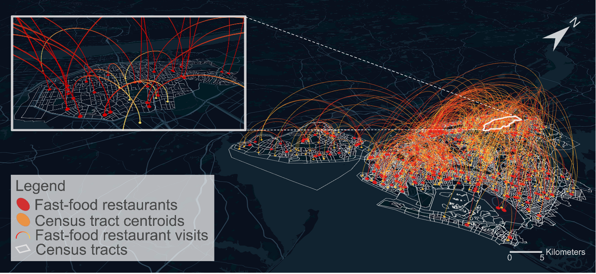
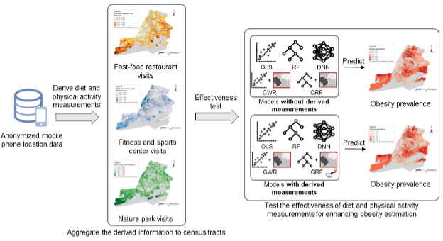

# Deriving neighborhood‑level diet and physical activity measurements from anonymized mobile phone location data for enhancing obesity estimation

### Overall description
Obesity is a serious public health problem. Existing research has shown a strong association between obesity and an individual’s diet and physical activity. If we extend such an association to the neighborhood level, information about the diet and physical activity of the residents of a neighborhood may improve the estimate of neighborhood-level obesity prevalence and help identify the neighborhoods that are more likely to suffer from obesity. However, it is challenging to measure neighborhood-level diet and physical activity through surveys and interviews, especially for a large geographic area. We propose a method for deriving neighborhood-level diet and physical activity measurements from anonymized mobile phone location data, and examine the extent to which the derived measurements can enhance obesity estimation, in addition to the socioeconomic and demographic variables typically used in the literature. We conduct case studies in three different U.S. cities, which are New York City, Los Angeles, and Buffalo, using anonymized mobile phone location data from the company SafeGraph. We employ five different statistical and machine learning model to test the potential enhancement brought by the derived measurements for obesity estimation, which are OLS (Ordinary Least Squares), GWR (Geographically Weighted Regression), RF (Random Forest), DNN (Deep Neural Network), and GRF (Geographical Random Forests).

This repository contains processed neighborhood-level diet and physical acticity measurements from anonymized mobile phone location data, socioeconomic and demographic variables from the American Community Survey (ACS) of the US Census Bureau, and scripts for performing five different statistical and machine learning models. More details about this work are available in our full paper:

<I>Zhou, R.Z., Hu, Y., Tirabassi, J.N. et al. Deriving neighborhood-level diet and physical activity measurements from anonymized mobile phone location data for enhancing obesity estimation. Int J Health Geogr 21, 22 (2022).</I>  [[PDF]](https://doi.org/10.1186/s12942-022-00321-4)
 

 
 

 
Figure 1. A map visualization of the visits from census tracts to fast-food restaurants in a week of 2018 in NYC.

 
 

 
Figure 2. An overview of the study design using NYC as an example.

 

### Repository organization

* Data/01 Processed Dataset: This folder contains processed neighborhood-level diet and physical acticity measurements from anonymized mobile phone location data, socioeconomic and demographic variables from the American Community Survey (ACS) of the US Census Bureau. The original anonymized mobile phone location data is from the company SafeGraph: https://docs.safegraph.com/docs/monthly-patterns.
* Data/02 Census Tract Shpfiles of Three Cities: This folder contains census tract shpfiles of NYC, LA, and Buffalo.
* Data/03 Data for Multicollinearity Diagnosis: This folder contains data for multicollinearity diagnosis.
* Data/04 Data for RF and DNN Optimal Parameters Search: This folder contains data for RF and DNN optimal parameters search, which is the random 70% dataset from "Data/01 Processed Dataset".
* Data/05 Coordinates info for GWR: This folder contains coordinate information of census tract centroids specifically for GWR model.
* Data/06 Data for GRF Optimal Parameters Search: This folder contains data for GRF optimal parameters search, which is the random 70% dataset from "Data/01 Processed Dataset" and has coordinate information of census tract centroids.
* Data/07 GRF Local Importance: This folder contains local feature importance generated from GRF model.
* SourceCode: This folder contains scripts for performing five different statistical and machine learning models and relevant analysis.

### Project dependencies
* Python 3.8

